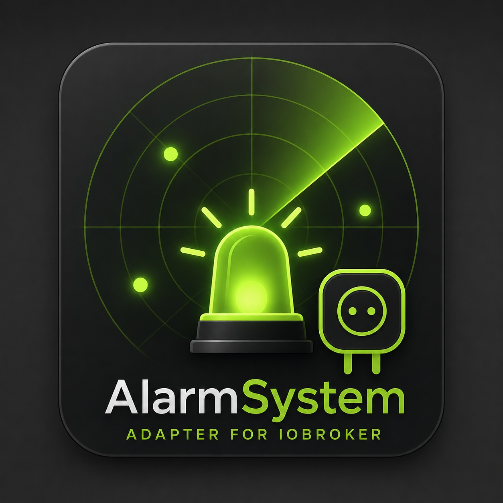

# ioBroker AlarmSystem Adapter

Custom ioBroker adapter blueprint and implementation for a modular alarm system.

## Goals
- Centralized alarm logic (FSM based)
- Fully configurable sensors, triggers, and cameras
- No hardcoded secrets (tokens/passwords are configured in adapter settings only)
- Extensible module structure for future hardware and integrations

## Security
No passwords/tokens are shipped as defaults. Fill credentials only in adapter instance settings.
